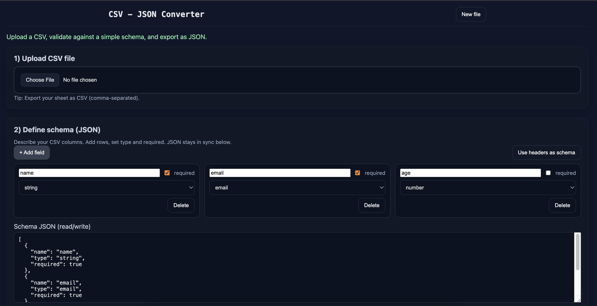
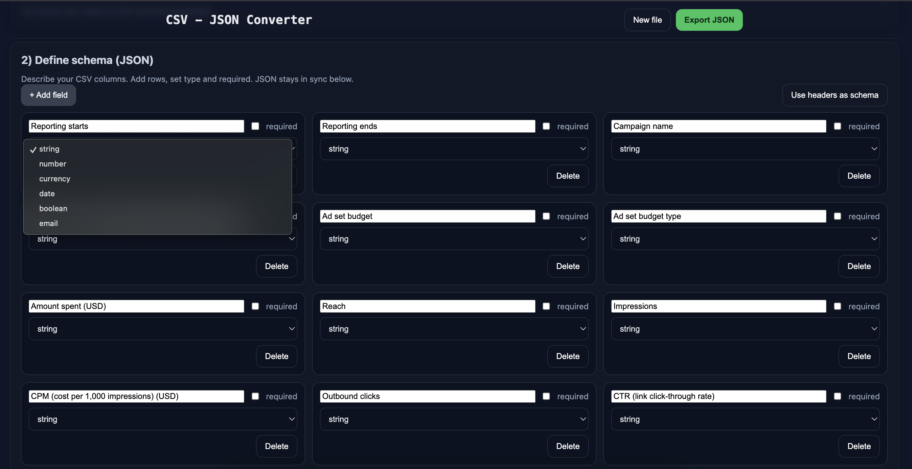

# CSV → JSON Converter

A React-based utility that lets you upload CSV files, validate them against a schema, and export clean JSON.  
Built for learning + portfolio demonstration.

---

## ✨ Features

- 📂 **Upload CSV** with header auto-detection (via PapaParse).
- 📝 **Schema Builder**:
  - Card-based UI in a responsive 3-column grid.
  - Define field name, type (`string`, `number`, `email`, `date`, …).
  - Mark fields as required.
  - Drag-and-drop reordering.
  - Syncs with live JSON.
- 👀 **Preview Table**:
  - First 10 rows shown.
  - Per-cell validation highlights.
  - Column headers draggable for reordering.
- ✅ **Validation Report**:
  - Row-by-row error list.
  - Download errors as CSV.
- 📤 **Export Options**:
  - Full JSON.
  - JSON with selected columns.
  - Export/import schema.

---

## 🖼️ Screenshots

### Home


### Schema Builder


### Preview + Validation


---

## 🛠️ Tech Stack

- [React (Vite)](https://vitejs.dev/)
- [PapaParse](https://www.papaparse.com/) for CSV parsing
- [file-saver](https://github.com/eligrey/FileSaver.js/) for downloads

---

## 🚀 Running locally

```bash
# clone this repo
git clone <your-repo-url>
cd csv-json

# install deps
npm install

# start dev server
npm run dev

📌 Notes
	•	Built for portfolio demonstration.
	•	Not production-hardened but easy to extend (XLSX, filters, API integration, etc.).
	•	Designed to be UI-friendly and modern.

👤 Author
Built by Walid (@devwalid)